# PagerPDF

<p align="center">
  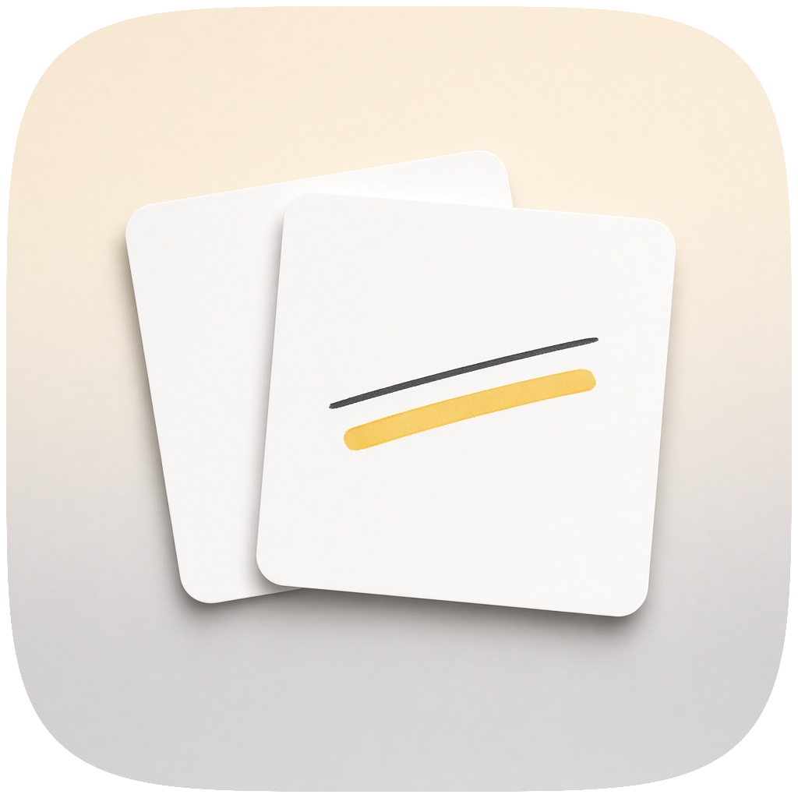
</p>

A native PDF reader and annotator for **macOS** and **iPadOS**. Pages stay sharp while you pinch, scroll, and mark them up. Ink, highlights, and shapes live in a sidecar next to the PDF so the original file is never rewritten unless you export.

Two apps share one engine:

| App | Target | Who it is for |
| --- | --- | --- |
| **PagerMac** | macOS 14+ | Mouse, trackpad, and a Preview-like window |
| **PagerPad** | iPadOS 17+ | Fingers to scroll, Apple Pencil to draw |

---

## Screenshots

### macOS

Continuous scroll with page thumbnails, a yellow highlight, and the markup bar:

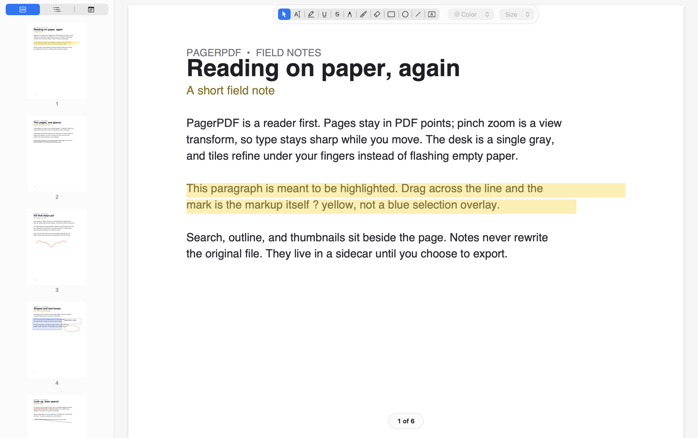

Two pages at a time — next/previous replaces the sheet instead of appending more pages:

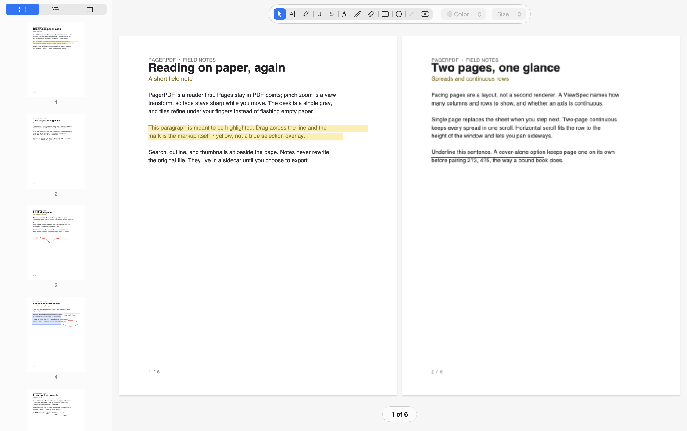

Two-page continuous: every spread stays in one scroll, with the next row peeking below:

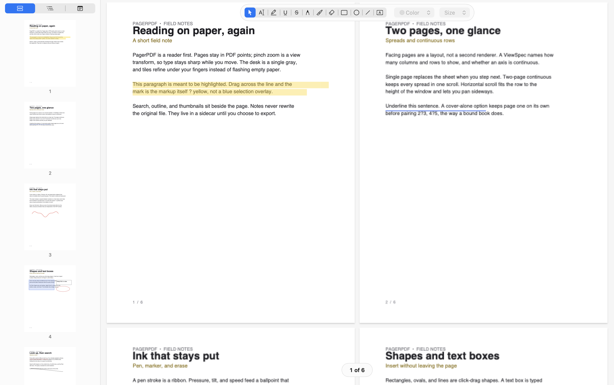

Horizontal scroll fits the row to the window height and pans sideways:

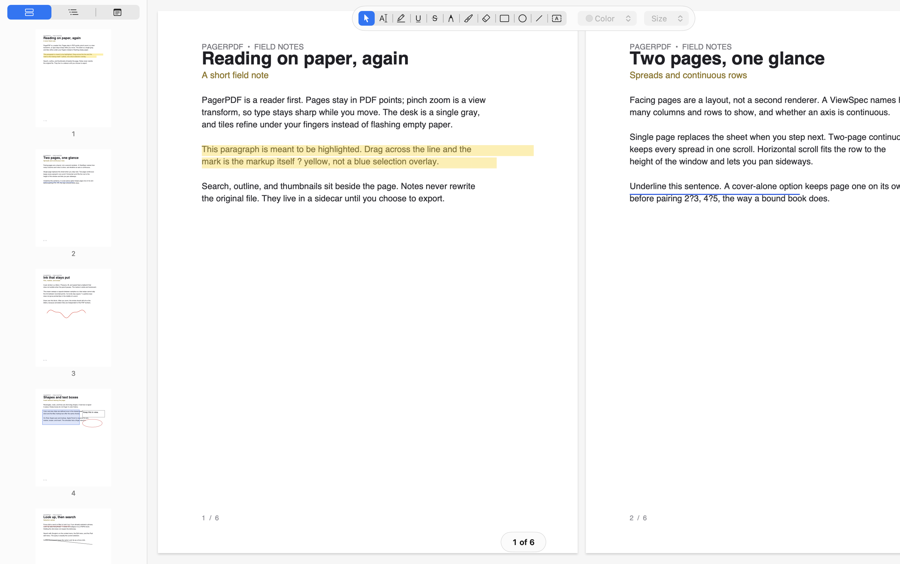

The Notes sidebar lists every mark — highlight, underline, ink, text box, shapes — without opening the original PDF:

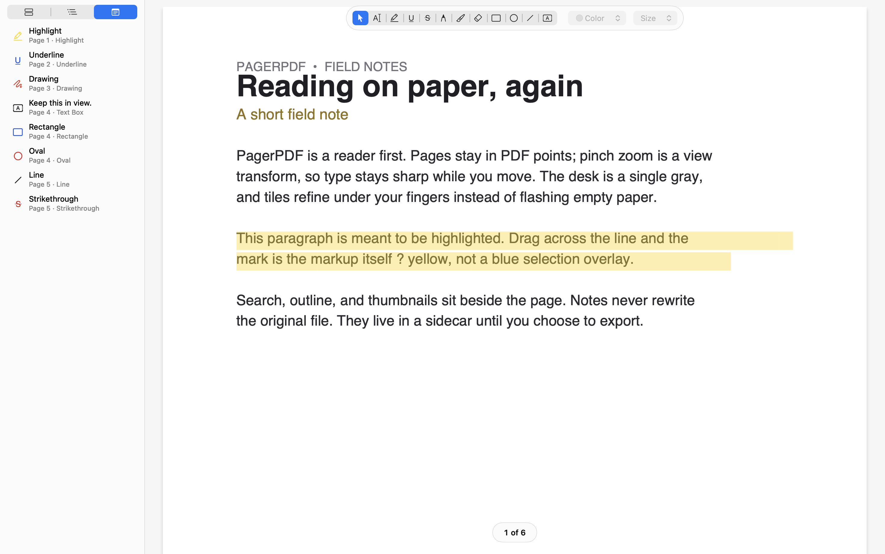

### iPadOS

Glass chrome, a floating page pill, and a dock that switches Cursor / Markup / Draw / Insert:

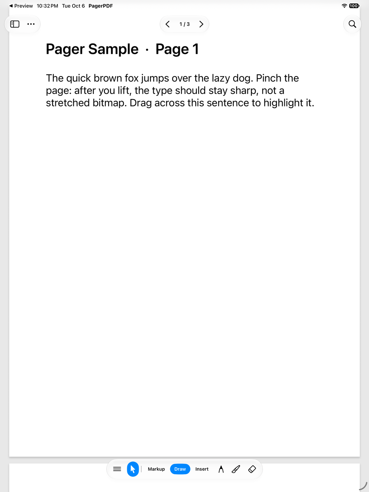

More → View is the same layout language as the Mac View menu. Columns, rows, or an axis can be continuous; Custom Layout lets you pick any grid:

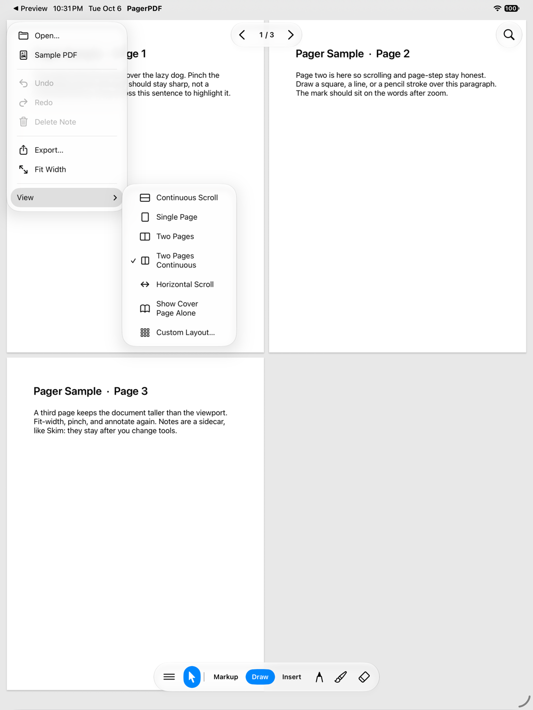

Two-page continuous packs facing pages into one scroll:

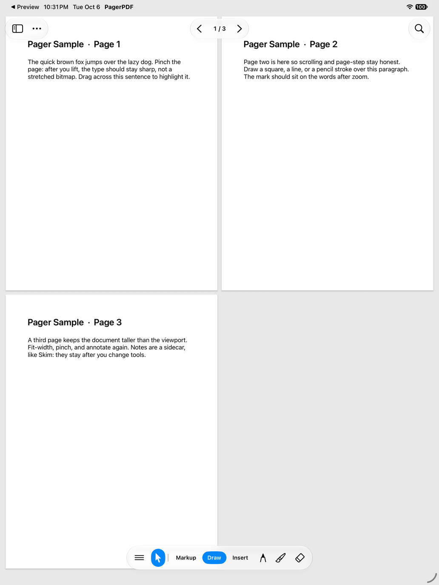

Two-page (paged) plus the Notes list — next/previous steps a sheet, and each highlight appears in the sidebar:

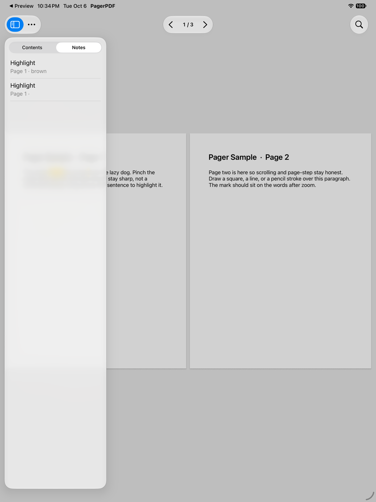

Horizontal scroll fits page height to the viewport; the sidebar lists the marks on the current document:

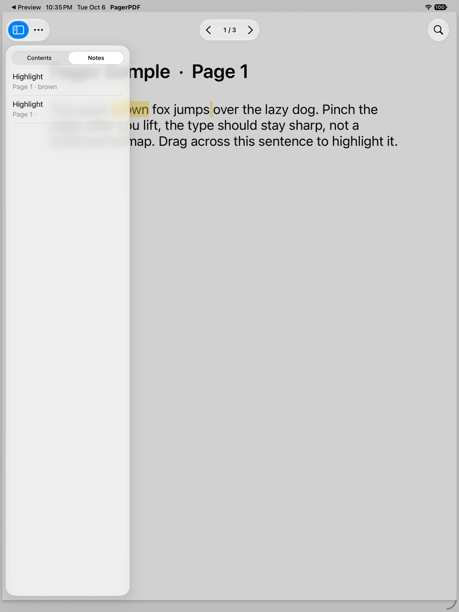

Markup is the mark itself. Tap a word or drag a line and the highlight lands in the palette color, not a blue selection overlay:

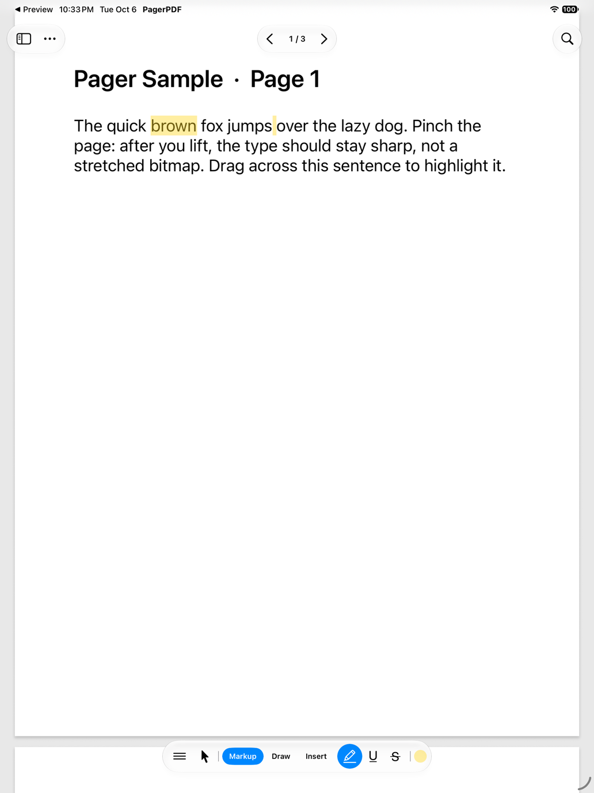

---

## What you can do

**Read.** Several viewing modes (below), pinch zoom, fit-to-view, outline, page thumbnails, and in-document links. Search jumps through hits without blocking the UI.

**Select.** Cursor / Select on Mac drags out a text selection immediately. On iPad, Cursor long-presses to select; Markup tools apply a highlight, underline, or strike as soon as you tap a word or drag across a line.

**Look up and search the web.** On Mac, force-click a word for Look Up. If a phrase is already selected, Look Up uses that phrase — it does not collapse it to a PDFKit word — and holding the click does not reopen the dictionary. **Search with Google** is on the context menu, the Edit menu, and the iPad edit menu; the query is exactly the current selection. Control-Command-D is the same Look Up as a force click.

**Markup.** Highlight, underline, and strike-out use the same color palette on both platforms. The live preview is the markup itself.

**Draw.** Pressure-sensitive pen, translucent marker, and an eraser that cuts ink along the stroke — a fast swipe does not skip gaps between touch events. Partially erased strokes keep square ends instead of growing pointed tips.

**Insert.** Rectangles, ovals, lines, and free-text boxes. Text is edited in place; empty boxes do not linger in undo history.

**Keep your notes.** Annotations are stored beside the PDF as `Document.pdf.notes`, with a copy in Application Support if the folder is read-only. Export produces a flattened PDF with everything burned in.

**Undo.** History records only the annotations an edit touched, so undo cost follows the change, not the size of the file.

---

## Viewing

Layout is a `ViewSpec`: how many **columns** and **rows** to show, and whether an axis is **continuous** (`0`). Both apps persist the last spec in `NSUserDefaults` (`PagerViewColumns`, `PagerViewRows`, `PagerViewCoverAlone`).

| Preset | Columns × rows | What you see |
| --- | --- | --- |
| Continuous Scroll | 1 × ∞ | The usual vertical strip. Next/previous scrolls to a page. |
| Single Page | 1 × 1 | Only the current page is on the canvas. Next/previous replaces it. |
| Two Pages | 2 × 1 | A facing sheet. Next/previous steps by sheet. |
| Two Pages Continuous | 2 × ∞ | Every spread stays in one scroll. |
| Horizontal Scroll | ∞ × 1 | A single row of every page. Pan sideways. |
| Custom Layout… | *N* × *M* | Any grid. Either axis can be Continuous. |
| Show Cover Page Alone | — | Page 1 sits by itself, then 2–3, 4–5, … like a bound book. |

A few packing rules keep the canvas honest:

- **Continuous** modes place every page. **Paged** modes place only the current sheet, so next/previous feels like turning a leaf.
- If both axes are continuous, the packer coerces to a 4-column vertical strip (`kAutoColumns`) instead of an infinite grid.
- **Fit policy.** Horizontal scroll (`continuous X`, fixed rows) fits the **viewport height**. Every other mode fits the sheet (or the content) to **width**. Changing spec always re-fits, then reveals the page you were on.
- Search, links, and page-step scroll to a rect, not a Y offset, so a horizontal strip still lands on the right page.
- After a spec or sheet change, existing page `CALayer`s are re-framed. Tiles stay in PDF points, so they do not have to be rebuilt just because the grid changed.

On Mac the presets live under **View**. On iPad they live under **More → View**. Both offer the cover-alone toggle and the custom columns × rows form.

---

## Architecture

PagerPDF is a small C++ core, a shared Objective-C++ canvas, and thin AppKit / UIKit hosts.

```
┌─────────────────────────────────────────────────────────────┐
│  PagerMac (AppKit)              PagerPad (UIKit)            │
│  PagerWindowController          ViewerViewController        │
│  PagerCanvasView                PadCanvasView               │
│  PagerDocument                  PadDocument                 │
└──────────────────────────┬──────────────────────────────────┘
                           │  PagerCanvasHost / SessionProvider
                           ▼
              ┌────────────────────────────┐
              │   PagerCanvasController    │
              │   tiles · chrome · gestures│
              └────────────┬───────────────┘
                           │
         ┌─────────────────┼─────────────────┐
         ▼                 ▼                 ▼
   DocumentSession    Viewport         OverlayRenderer
   NoteDocument       TileCache        AnnotationRasterizer
   Ink / Geometry     PDFKitPageSource NoteArchive
```

**DocumentSession** is the live document: current tool and styles, text selection, search hits, the in-progress pen stroke, a shape draft, and the current `ViewSpec` / sheet. It talks to **NoteDocument** for the annotation list and undo stack.

**Viewport** owns page layout and a worker pool that rasters PDF tiles. Layout is always in PDF points (scale 1). `setViewSpec` / `setSheet` rebuild the packer and bump the tile generation so stale tiles cannot attach to the new frames. Pinch zoom is the scroll view’s magnification, so the canvas size does not jump when you zoom.

**Layout** is a packer, not a second renderer. Continuous-Y wraps columns; continuous-X builds `ceil(n / rows)` columns; paged mode slices the current sheet. `pageAt` and `pagesIntersecting` scan every placed frame, so hit-testing stays correct on a grid.

**PagerCanvasController** is the shared canvas. It places page and annotation `CALayer`s, runs every annotation gesture, and asks the host only for things that are truly platform-specific (the text editor, pan suspension, opening a link). After a layout change it reapplies frames to the layers that are already on screen. Mac and iPad canvas views are hosts, not second copies of the interaction model.

**PDFKitPageSource** wraps PDFKit. Rasterization and flattened export use private `PDFDocument` instances so a slow page never blocks selection or search. Annotations that already exist in the PDF are imported for reference and left to PDFKit’s appearance streams — they are not painted again.

---

## How a page is drawn

Nothing is a document-sized bitmap.

1. Each PDF tile is a `CALayer` whose `contents` is a pre-rendered `CGImage`.
2. Committed notes are rasterized on a **separate thread** (`AnnotationRasterizer`) into transparent tiles, so scrolling never waits on ink and an edit never waits on a slow PDF page.
3. A low-resolution **base band** sits under the sharp tiles, so a fast scroll or pinch-out never flashes empty paper.
4. Live ink, a shape you are still dragging, and a note that just committed are drawn into a screen-sized overlay until their tiles arrive.
5. Selection, search hits, and resize handles are `CAShapeLayer`s.

Tiles are keyed by page, scale band (hundredths of zoom), column, and row. The cache is an LRU bounded by decoded bytes. During a live pinch only the cheap base rasters are requested; the current band refines when the gesture settles.

The desk behind the pages is a single gray (`pager::kCanvasGray`). Every surface that can show through uses that color so a zoom never looks like a flash.

On iPad the zoom view is a `_zoomContent` wrapper around the canvas. Fit-to-view resets `zoomScale` to 1, resizes that wrapper to the new document frame, then applies the mode-aware fit. That keeps a horizontal strip from getting stuck after the second page.

---

## Tools

| Tool | What it does |
| --- | --- |
| Select / Cursor | Pan, follow links, select notes. On Mac, a drag on empty page selects text. |
| Text Selection | Explicit text-select tool (iPad read set; Mac toolbar). |
| Highlight / Underline / Strike | Drag or tap text; the mark is applied on lift, in the style color. |
| Pen | Pressure, tilt, and speed → a stable ballpoint ribbon. |
| Marker | Wide translucent stroke, no pressure. |
| Eraser | Sweeps a capsule between samples and splits ink on segments, not just at recorded points. |
| Rectangle / Oval / Line | Click-drag shapes. |
| Text Box | Tap to place, type in place. |

On a physical iPad, fingers pan and markup; Pencil is required for pen, marker, eraser, and insert tools. The simulator lets a finger stand in for the Pencil.

Color and size chips are defined once in `ToolPalette` so the iPad dock and the Mac markup bar offer the same choices.

---

## Notes on disk

Saves are a property list of annotations (kind, page, color, quads, ink samples, …). Geometry is stored as number arrays so values round-trip at full double precision. Older string-formatted archives still load.

Write path:

1. Debounced encode off the main thread.
2. Atomic write to `YourFile.pdf.notes` next to the PDF.
3. The same payload under `~/Library/Application Support/PagerPDF/Notes/<sha256>.plist`.

Load prefers whichever copy is newer, so a failed sidecar write (file provider, read-only folder) does not drop work. The PDF itself is left alone until **Export as Annotated PDF**.

---

## Platform chrome

The two hosts share tools and layout, but they are not the same window.

**Mac.** An `NSDocument` window with a sidebar (thumbnails / table of contents / notes), a toolbar for page, zoom, share, and find, and a markup bar that tucks away. View presets are a real menu. Force-click and the context menu carry Look Up and Search with Google. Windowed traffic lights sit next to a corner-adapted nav pill so the chrome does not overlap when the window is floating.

**iPad.** Glass pills for sidebar/more, page step, and find. A dock you can drag to an edge: Cursor, Markup / Draw / Insert, then the tools and color/size wells for that set. Color and size open as popovers that do not dismiss the dock. Fingers scroll; Pencil draws. There is no separate “read pane” — the page *is* the pane.

---

## Design notes

- **Layout stays in PDF points.** Zoom is a view transform. Tiles rendered at an old scale still sit on the same page frames, so they can remain visible as a pinch interpolates.
- **Viewing is a packer.** Changing 1-up to 2-up does not start a second renderer; it rebuilds frames and re-fits.
- **Main thread does not rasterize.** PDF workers and the annotation worker publish `CGImage`s; the canvas only attaches them to layers.
- **Gestures are document-space.** Hosts convert pointer events once. The controller does not know about `NSEvent` or `UITouch`.
- **Imported PDF annotations are not redrawn.** Re-stroking someone else’s appearance stream is how notes drift. Export is the one path that burns PagerPDF notes into page content.

---

## Project layout

```
Core/
  Include/          Public C++ headers (session, geometry, ink, viewport, ViewSpec, …)
  Session/          DocumentSession, ToolPalette
  Annotations/      NoteDocument, hit testing, ink erase
  Geometry/         Page frames, zoom math, layout packer
  Ink/              Stroke builder and ribbon triangulation
  Render/           Viewport workers and tile cache
  Bridge/           Canvas controller, PDFKit, overlay, archive (ObjC++)
Platform/
  Mac/              PagerMac — window, toolbar, sidebar, NSDocument
  Pad/              PagerPad — glass chrome, dock, UIDocument
Design/
  AppIcon.png       Marketing / source icon
  Screenshots/      macOS and iPadOS captures used in this README
Tests/
  PagerCoreTests.mm Geometry, tiles, ink, archive, canvas, ViewSpec
gen_project.py      Regenerates PagerPDF.xcodeproj
```

Shared code is C++20. Platform and bridge files are Objective-C++. The Xcode project is generated; after adding a source file, run `python3 gen_project.py`.

---

## Build

Open `PagerPDF.xcodeproj` and pick a scheme:

| Scheme | Result |
| --- | --- |
| **PagerMac** | `PagerMac.app` |
| **PagerPad** | `PagerPad.app` (iPad device or simulator) |
| **PagerCoreTests** | Hosted in PagerMac; exercises core, archive, and the Mac canvas |

From the command line:

```bash
xcodebuild -scheme PagerMac -configuration Debug build
xcodebuild -scheme PagerPad -destination 'platform=iOS Simulator,name=iPad Pro 13-inch' build
xcodebuild -scheme PagerCoreTests test
```

Deployment targets are **macOS 14** and **iPadOS 17**. The apps link PDFKit, Core Text, and QuartzCore.
